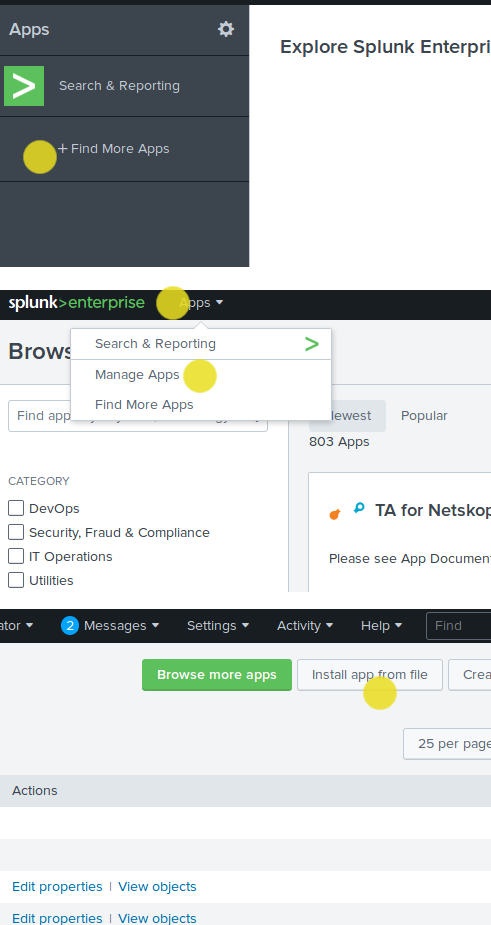

# Splunk Protect Integration

This repo is for integrating Egnyte Protect with Splunk. There are mainly two modules in Splunk Integration.

- Egnyte Protect Add-on For Splunk:
    This module would be used to configure, collect and ingest events from Egnyte Protect APIs into Splunk
- Egnyte Protect App For Splunk:
    This module would host all the default visualizations based on the data which would be collected part of Splunk.

# How to install & setup Splunk?
- [OS specific Installation Process](https://docs.splunk.com/Documentation/Splunk/7.2.5/SearchTutorial/InstallSplunk)
- [Setting up Splunk in Docker](https://docs.splunk.com/Documentation/Splunk/7.2.4/Installation/DeployandrunSplunkEnterpriseinsideDockercontainers)

### Local/dev installation

- run `./start.sh` to start splunk in docker
- open localhost:8000
- load app files from build 


# App Specification Document (For Installing & Setting up Apps in Splunk)
- [Document](https://docs.google.com/document/d/1QqOPITxa1-U_XQG4UD9-kreOaSKjpKZckm-Azh6xTvY/edit?usp=sharing)

# File Structure of both the Apps
- **Egnyte App for Splunk**
    - default : All the default configurations of the App.
        - app.conf --> default App configuration file, for example Application version
        - ui-nav --> App Menu Options are defined in default.xml file
        - ui-views --> Default dashboard configurations files are located here.
        - macro.conf --> Creating a macro in the App to allow single point of search in all the dashboard queries.
    - metadata : this folder consists a meta file which drives the App Access rights.
    - static : this folder consists default icons of the App.
- **Egnyte Add-on for Splunk**
    - appserver : All the UI specific assets are generated in this folder.
    - bin : All the binary files(python files) related to API calls are defined in this folder. 
    - default : All the default configurations of the App.
        - app.conf --> default App configuration file, for example Application version
        - inputs.conf --> For storing Add-on input details once it's created
        - props.conf --> All the Field extractions are written in this file.
        - tags.conf --> CIM data model tagging
        - ui-nav --> App Menu Options are defined in default.xml file
        - ui-views --> Default UI to allow user to enter API details.
        - macro.conf --> Creating a macro in the App to allow single point of search in all the dashboard queries.
    - metadata : this folder consists a meta file which drives the App Access rights.
    - static : this folder consists default icons of the App.
- **Details of Binary files**
    - egnyte.py : This is the invocation file for Splunk's Modular input
    - input_module_egnyte.py : This file is the heart of data collection where we have the actual code for data collection
    - ta_egnyte_protect_utility.py : This is the utility file for Addon. This file contains the main API call for data collection and generate refresh/auth token
    - TA_egnyte_protect_rh_egnyte.py and TA_egnyte_protect_rh_settings.py : This files are AoB generated and used for storing values into conf files

# Updating Dashboard Queries

- Login to splunk and install the App.
- Go to Dashboard click on "Edit"
- Once the changes are done click on "Save".
- The files would get stored under ```/opt/splunk/etc/apps/local``` folder.
- Copy the files to commit into Git.

# Troubleshooting

- Checking if the events are being indexed after configuring Add-on
    - Click on "Search" in either Egnyte App or Add-on
    - Run below query
        ``` `egnyte_get_index` ```
    > The current configuration would enable Add-on Input to call for the Egnyte API endpoint hit as soon as configurations are saved. it would sometime take few minutes for user to see the events in the index.

- How to check the queries which are running for each panel?
    - On each panel on the bottom right hand side there could be three small icons would be visible once scroll on that panel.
        - Magnifying Glass : It would allow you to open a search window on a seperate screen to see the search which is executing.
        - i icon: It would tell you the performance of that search query. It would depict how much time does this panel take to load against the number of records fetched.

- How to update API endpoints for Production or further versions of the App?
    - ta_egnyte_contants.py (TA-egnyte-protect/bin)
        Need to change the API endpoints which are defined in this.
    - common.js (TA-egnyte-protect/appserver/static/js/build)
        Use find and replace command to replace the URL
        Replace ```https://usc1-stage-api.egnyteprotect.com/oauth2/code?client_id=pxhzq22ds3jp75bwtjq6vhme&no_redirect=true&response_type=code``` with the new one

# Versioning of the App

App versioning in the Splunk App is controlled by a single file ```default/app.conf``` in both the modules.

You can change ```version``` field in this file to update the version of the Splunk App.

```
#
# Splunk app configuration file
#
[ui]
is_visible = 1
label = Egnyte Protect App for Splunk

[launcher]
author = Egnyte Inc
description = This application provides dashboards for tracking Splunk to Egnyte Protect integration.
version = 1.0.0


[package]
id = egnyte_protect
check_for_updates = 1
```
> Official Doc of [App.conf](https://docs.splunk.com/Documentation/Splunk/7.2.5/Admin/Appconf)

# Package the App

We can create the Package of the Splunk using the Splunk CLi.

- Run the docker container with official Splunk Image
    ```
    $docker run -d -p 8000:8000 -e 'SPLUNK_START_ARGS=--accept-license' -e 'SPLUNK_PASSWORD=admin123' splunk/splunk:latest
    ```
- Copy the latest Splunk App code into docker container.
    ```
    $ cd <<Git Folder>>/src/
    $ docker cp . <<Docker ID>>:/opt/splunk/etc/apps/
    ```    
- Change the ownership of the Apps
    ```
    $ chown -R splunk:splunk /opt/splunk/etc/apps/TA-egnyte-protect
    $ chown -R splunk:splunk /opt/splunk/etc/apps/Egnyte_Protect
    ```
- Egnyte App for Splunk

    ```
    $ cd /opt/splunk/bin
    $ ./splunk package app Egnyte_Protect
    ```
- Egnyte Add-on for Splunk

    ```
    $ cd /opt/splunk/bin
    $ ./splunk package app TA-egnyte-protect
    ```
- Copy the location given by the previous command output and commit to ```build``` directory on GitLab.

## Packaging on CI
### ***---DEPRECATED---***
A part of CI process is generating .spl package files from the current app version. After successful build they are stored as artifacts. For creating build files we need splunk binary which is available from inside running splunk container. Initailly splunk binary doesn't exist inside container. It is produced as a result of ansible script which is fired on the container start through configured entrypoint. Because of that we weren't able to use splunk/splunk:latest image as a base image for build process because of lack of splunk binary inside. Creating custom image from running container with binary being already inside also failed.

Solution is running splunk container inside build container. Script needs to wait for splunk initialization. After that apps code is copied to container and splunk binary is used to generate package. Then .spl files are fetched from container and marked as artifacts.

In case when ```sleep 60``` stops being enough ```/opt/splunk/etc/apps``` or ```/opt/splunk/bin/splunk``` might not exist. One of below errors may appear:
```
ls: cannot access '/opt/splunk/etc/apps': No such file or directory
```
```
OCI runtime exec failed: exec failed: container_linux.go:344: starting container process caused "exec: \"/opt/splunk/bin/splunk\": stat /opt/splunk/bin/splunk: no such file or directory": unknown
```
```
ERROR: Couldn't read "/opt/splunk/etc/splunk-launch.conf" -- maybe $SPLUNK_HOME or $SPLUNK_ETC is set wrong?
```
### ***---ACTUAL VERSION---***
As ```.spl``` files are technically ```.tar.gz``` files there is no need to use Splunk binary to create them. It's enough to use just ```tar``` and ```gzip```. However we need to make sure that all files/folders in archive have proper permissions required by Splunkbase. 